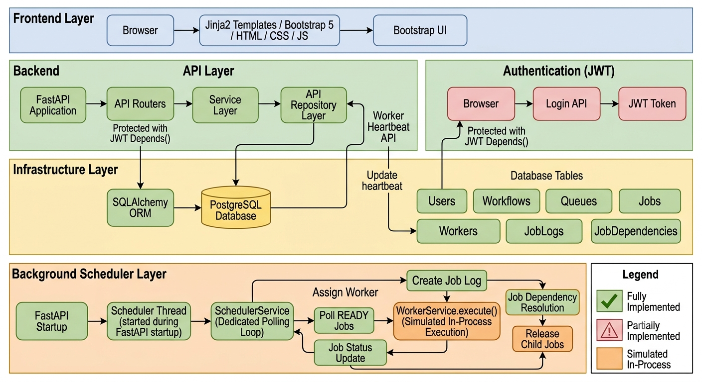
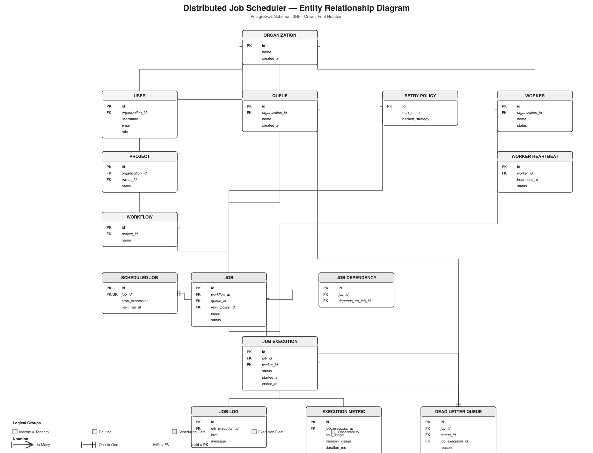
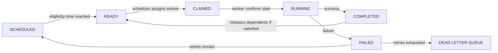
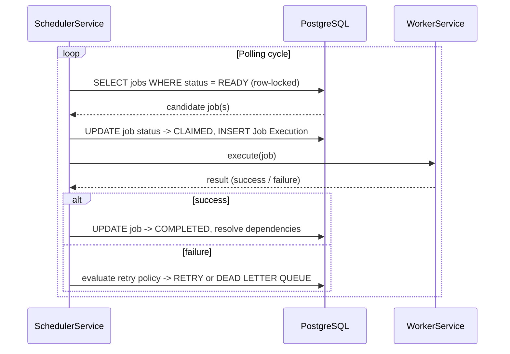
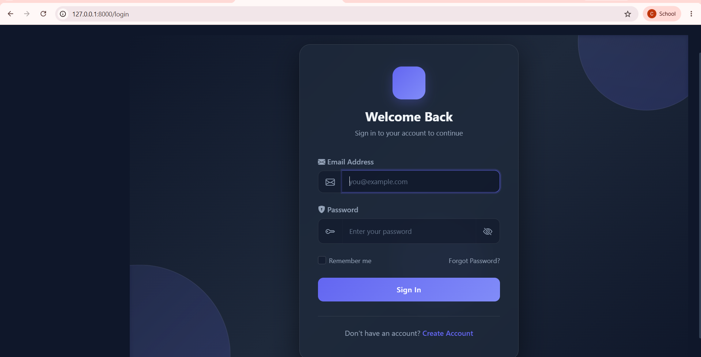
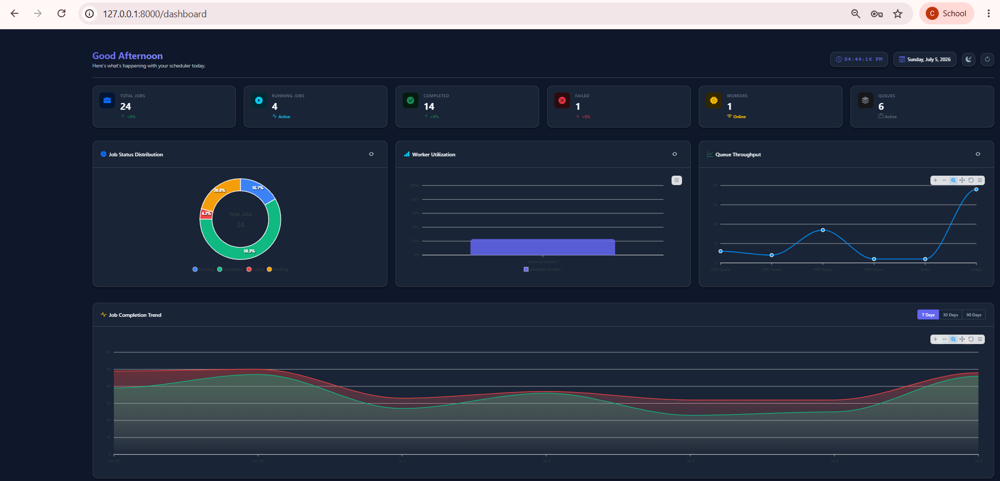
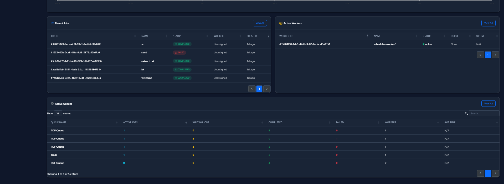
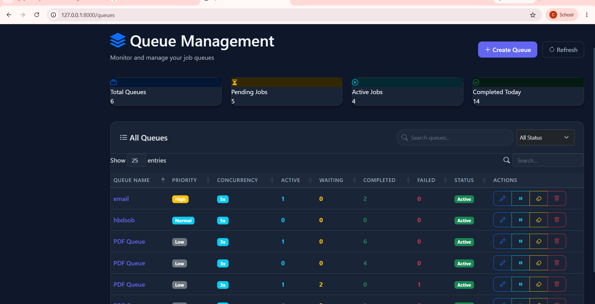
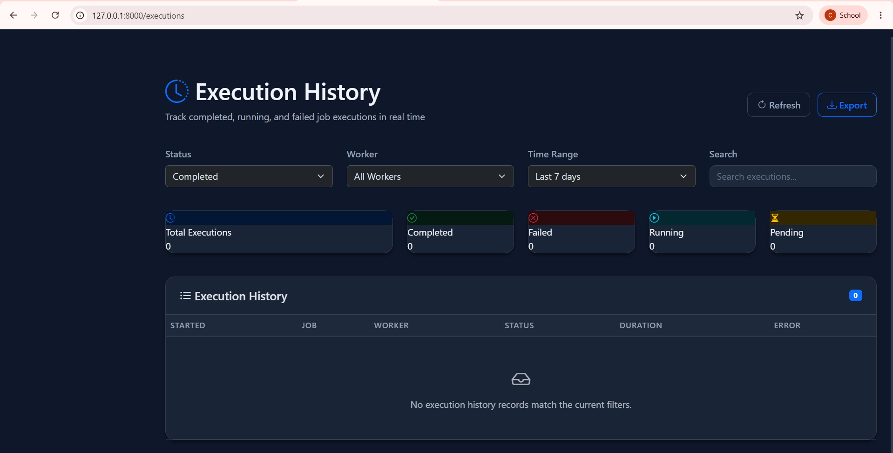
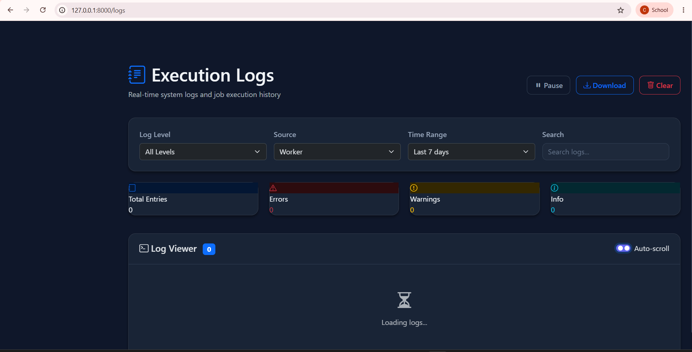

# ⚙️ Distributed Job Scheduler
### Backend Job Scheduling & Execution Platform

**Backend platform for scheduling, executing, and monitoring asynchronous background jobs across queues and workers. Every job claim is atomic. Every state transition is explicit and auditable.**


---

# Distributed Job Scheduler

A backend job scheduling platform built with FastAPI and PostgreSQL that handles asynchronous job execution across queues and workers — including atomic job claiming, configurable retry policies, workflow dependencies, and a dead letter queue for permanently failed jobs.

This project was built as a backend engineering assignment focused on database design, concurrency correctness, and system design judgment rather than feature count. It currently runs entirely on `localhost`; see [Current Limitations](#current-limitations) for what that means in practice.

---

## Project Overview

Background job processing looks simple until you account for concurrency and failure: keeping two workers from claiming the same job, recovering from a worker that dies mid-execution, retrying failures without retrying forever, and giving an operator visibility into what ran and what didn't. This project treats those as first-class requirements instead of an afterthought bolted onto a simple queue table.

**Assignment objective:** design and implement a job scheduling platform that demonstrates backend engineering judgment — database design, concurrency handling, API design, and full system delivery — rather than the raw number of features implemented.

**Core engineering concepts implemented:**

- Atomic job claiming under concurrent polling, using row-level locking
- A full job lifecycle state machine with explicit failure and retry paths
- A third-normal-form relational schema across 15 entities
- Configurable, queue-level retry policies (fixed, linear, exponential backoff)
- Job dependency graphs (workflows) with cascading release logic
- JWT-based authentication with organization-level tenant isolation
- A hand-written polling scheduler, not a third-party task queue library

Where a feature was simplified or simulated because of the scope of the assignment — rather than because it was the "correct" production design — that trade-off is documented explicitly in the [Engineering Design Decisions](#engineering-design-decisions) and [Current Limitations](#current-limitations) sections below, and in more depth in the full [engineering design document](./docs/Distributed_Job_Scheduler_Design_Document.docx).

---

## Features

**Authentication**
- JWT-based login and registration
- Every protected route resolves the current user via FastAPI's `Depends()` before the handler runs
- Organization-scoped tenancy: a request can only touch resources belonging to its own organization

**Projects**
- Projects group related workflows and queues under an organization
- Ownership tracked per project (`owner_id`)

**Queues**
- Configurable priority, concurrency limit, and default retry policy
- Pause / resume without touching the jobs already inside the queue
- Computed queue statistics (backlog, concurrency usage, throughput) on read

**Scheduler**
- A dedicated background thread started at FastAPI startup
- Polls for `READY` jobs, assigns them to available workers, and drives every status transition

**Workers**
- Self-registering execution units with an idle / busy / offline status
- Periodic heartbeats used to detect a crashed worker
- Execution is simulated in-process in this implementation (see [Current Limitations](#current-limitations))

**Job Lifecycle**
- Five job creation modes: immediate, delayed, scheduled, recurring (cron), and batch
- Explicit states: `READY`, `SCHEDULED`, `CLAIMED`, `RUNNING`, `COMPLETED`, `FAILED`, `RETRY`, dead-lettered

**Retry Policies**
- Reusable, queue-level retry configuration (max retries + backoff strategy)
- Jobs can inherit a queue's policy or override it individually

**Workflow Dependencies**
- Jobs can depend on other jobs, forming a dependency graph
- A child job is released only once *every* parent has reached `COMPLETED`

**Dashboard**
- Server-rendered (Jinja2 + Bootstrap 5) operator dashboard
- Queue health, job inspection, worker status, and execution history

**Monitoring**
- Structured execution logs per job run
- Per-execution resource metrics (CPU, memory, duration)
- Dead letter queue view for failed jobs across all queues

**REST APIs**
- Resource-oriented API (auth, projects, queues, workflows, jobs, workers, dashboard)
- Consistent pagination, filtering, and structured error responses across endpoints

---

## Technology Stack

| Category | Technology | Purpose |
|---|---|---|
| API Framework | FastAPI | Async request handling, dependency injection, request/response validation |
| Language | Python | Application language across API, services, and scheduler |
| Database | PostgreSQL | Relational storage for all job, queue, and execution state |
| ORM | SQLAlchemy | Maps Python models to schema tables; expresses relationships between jobs, queues, and executions |
| Migrations | Alembic | Versioned schema migrations |
| Authentication | JWT (PyJWT / python-jose) | Stateless bearer-token authentication |
| Password Hashing | Passlib (bcrypt) | Salted password hashing at registration and login |
| Templating | Jinja2 | Server-rendered dashboard pages |
| Frontend Styling | Bootstrap 5 | Dashboard layout and components |
| Validation | Pydantic | Request/response schema validation at the API boundary |
| Background Processing | Python `threading` | In-process scheduler polling loop |

---

## System Architecture



The system is a single FastAPI application composed of five layers:

- **Frontend layer** — server-rendered Jinja2 templates styled with Bootstrap 5. No separate SPA build step.
- **Backend API layer** — routers → services → repositories. Routers stay thin and only translate HTTP into a single service call; services hold business rules; repositories are the only layer allowed to issue SQLAlchemy queries.
- **Authentication layer** — a standard JWT flow. Login issues a signed token; every other protected route verifies it through `Depends()`.
- **Infrastructure layer** — SQLAlchemy sits between the repository layer and PostgreSQL, which is the single source of truth for all job, queue, and worker state.
- **Background scheduler layer** — a dedicated thread started at FastAPI startup that polls for ready jobs, assigns them to workers, and drives status transitions.

There is deliberately no external message broker or distributed lock service in this implementation. PostgreSQL itself is the coordination point, using row-level locking to make job claims atomic. This keeps the system small enough to reason about completely, at the cost of the horizontal scalability a broker-based design would provide — see [Engineering Design Decisions](#engineering-design-decisions).

The diagram above also marks which parts of the system are fully implemented, partially implemented, or simulated in-process (worker execution) for this assignment.

---

## Database Design



The schema is normalized to third normal form across 15 entities, grouped into five logical clusters: identity and tenancy (`Organization`, `User`, `Project`), routing (`Workflow`, `Queue`, `Retry Policy`), scheduling core (`Job`, `Scheduled Job`, `Job Dependency`), execution fleet (`Worker`, `Worker Heartbeat`, `Job Execution`), and observability (`Job Log`, `Execution Metric`, `Dead Letter Queue`).

Retry configuration and recurring-job scheduling metadata are kept in their own tables rather than as nullable columns on `Job`, since both only apply to a subset of jobs. Job dependencies are modeled as their own join table rather than a self-referencing foreign key, which is what allows a job to wait on more than one predecessor. Indexes are built around two access patterns specifically: the scheduler's `(queue_id, status)` polling query on `Job`, and time-ordered history lookups on `Job Execution` and `Worker Heartbeat`.

---

## Project Structure

```
distributed-job-scheduler/
├── app/
│   ├── api/
│   │   ├── __init__.py
│   │   ├── auth.py
│   │   ├── dashboard.py
│   │   ├── job.py
│   │   ├── job_dependency.py
│   │   ├── job_execution.py
│   │   ├── queue.py
│   │   ├── worker.py
│   │   └── workflow.py
│   ├── core/
│   │   ├── __init__.py
│   │   ├── auth.py
│   │   ├── config.py
│   │   └── security.py
│   ├── database/
│   │   ├── __init__.py
│   │   ├── base.py
│   │   ├── create_tables.py
│   │   ├── dependencies.py
│   │   └── session.py
│   ├── models/
│   │   ├── __init__.py
│   │   ├── job.py
│   │   ├── job_dependency.py
│   │   ├── job_execution.py
│   │   ├── job_log.py
│   │   ├── queue.py
│   │   ├── user.py
│   │   ├── worker.py
│   │   └── workflow.py
│   ├── repositories/
│   │   ├── __init__.py
│   │   ├── job_dependency_repository.py
│   │   ├── job_execution_repository.py
│   │   ├── job_log_repository.py
│   │   ├── job_repository.py
│   │   ├── user_repository.py
│   │   └── worker_repository.py
│   ├── schemas/
│   │   ├── __init__.py
│   │   ├── job.py
│   │   ├── job_dependency.py
│   │   ├── job_execution.py
│   │   ├── queue.py
│   │   ├── user.py
│   │   ├── worker.py
│   │   └── workflow.py
│   ├── services/
│   ├── scheduler/
│   ├── static/
│   │   ├── css/
│   │   └── js/
│   │       ├── api.js
│   │       ├── auth.js
│   │       ├── dashboard.js
│   │       ├── execution-manager.js
│   │       ├── jobs.js
│   │       ├── logs.js
│   │       ├── navigation.js
│   │       ├── queues.js
│   │       ├── router.js
│   │       ├── utils.js
│   │       └── workflows.js
│   ├── templates/
│   │   ├── partials/
│   │   ├── 404.html
│   │   ├── 500.html
│   │   ├── base.html
│   │   ├── dashboard.html
│   │   ├── execution_detail.html
│   │   ├── jobs.html
│   │   ├── job_details.html
│   │   ├── login.html
│   │   ├── queue_details.html
│   │   ├── queues.html
│   │   ├── register.html
│   │   ├── settings.html
│   │   ├── worker_details.html
│   │   ├── workers.html
│   │   └── workflow_detail.html
│   └── main.py
├── workers/
├──architecture/
│   ├── architecture_diagram.png
│   ├── er_diagram.png
│── screenshots/
│       ├── dashboard_1.png
│       ├── dashboard_2.png
│       ├── execution_history.png
│       ├── execution_logs.png
│       ├── jobs.png
│       ├── login_page.png
│       └── queue.png
├── migrations/
├── tests/
├── venv/
├── .env
├── .gitignore
├── alembic.ini
├── README.md
└── requirements.txt

```

Each folder has one reason to change: a router never imports a repository directly, and a repository never contains business logic. That boundary is what keeps the three core layers independently testable.

---

## Job Lifecycle

A job moves through a fixed set of states, and every transition is a single atomic update to the job row.

| State | Meaning |
|---|---|
| `READY` | No unmet dependencies, scheduled time (if any) has passed. Eligible for the next polling cycle. |
| `SCHEDULED` | Has a future eligibility time held in `Scheduled Job`. Not yet a candidate for assignment. |
| `CLAIMED` | A worker has just been assigned; a `Job Execution` row is inserted in the same transaction. |
| `RUNNING` | The worker has confirmed it began execution. |
| `COMPLETED` | Execution succeeded. Dependent jobs are evaluated for release. |
| `FAILED` | The execution attempt failed. Immediately evaluated against the retry policy. |
| `RETRY` | Retries remain; the job re-enters the `SCHEDULED` → `READY` path at a computed future time. |
| `DEAD LETTER QUEUE` | Retries exhausted. Recorded permanently for operator review and manual replay. |



`CLAIMED` exists as a distinct, brief state from `RUNNING` specifically to make one failure mode visible: a job stuck in `CLAIMED` with no progress means a worker accepted an assignment but never actually started it.

---

## Scheduler Workflow

The scheduler runs as a dedicated thread inside the same FastAPI process, started during the application's startup event. It is a hand-written Python polling loop, not a third-party task queue library — see [Engineering Design Decisions](#engineering-design-decisions) for why.



The claim itself — selecting a candidate job with a row-level lock and updating it in the same transaction as the `Job Execution` insert — is what guarantees a job is never claimed by two workers at once, even under concurrent polling.

---

## Worker Architecture

**Registration** — a worker registers itself with the API on startup, creating a `Worker` row with an initial `idle` status. A worker that never registers is never a candidate for assignment.

**Polling** — the scheduler initiates polling, not the worker: `SchedulerService` queries for `READY` jobs and pushes work to available workers, rather than each worker polling independently. This keeps concurrency-limit and priority checks enforceable in one place.

**Execution** — once claimed, `WorkerService.execute()` runs the job and produces `Job Log` entries and an `Execution Metric` row on completion. In this implementation, execution runs in-process rather than on a physically separate worker (see [Current Limitations](#current-limitations)).

**Heartbeats** — each worker writes a heartbeat row on a fixed interval, independent of whether it's currently executing a job. A background check flags a worker as unresponsive after it misses more than a small number of consecutive heartbeats.

**Recovery** — any job held by an unresponsive worker in `CLAIMED` or `RUNNING` is treated as failed and re-enters the normal retry-or-dead-letter path. A single worker crash is bounded in effect: the job it held is recovered within one heartbeat-check interval.

---

## REST API Overview

All endpoints are prefixed under `/api` and require a bearer JWT except login and registration.

**Authentication**
- `POST /api/auth/register`
- `POST /api/auth/login`
- `GET /api/auth/me`

**Projects**
- `POST /api/projects`
- `GET /api/projects`
- `GET /api/projects/{id}`
- `PATCH /api/projects/{id}`
- `DELETE /api/projects/{id}`

**Queues**
- `POST /api/queues`
- `GET /api/queues`
- `PATCH /api/queues/{id}`
- `POST /api/queues/{id}/pause`
- `POST /api/queues/{id}/resume`
- `GET /api/queues/{id}/stats`

**Jobs**
- `POST /api/jobs`
- `GET /api/jobs`
- `GET /api/jobs/{id}`
- `GET /api/jobs/{id}/executions`
- `GET /api/jobs/{id}/logs`
- `POST /api/jobs/{id}/retry`

**Workers**
- `POST /api/workers/register`
- `POST /api/workers/{id}/heartbeat`
- `GET /api/workers`
- `GET /api/workers/{id}`

**Dashboard**
- `GET /api/dashboard/overview`
- `GET /api/dashboard/throughput`
- `GET /api/dashboard/dead-letter-queue`

This is not an exhaustive list of every endpoint or parameter — full request/response schemas are in the [engineering design document](./docs/Distributed_Job_Scheduler_Design_Document.docx).

---

## Dashboard

**Login**



**Dashboard overview** — job status distribution, worker utilization, queue throughput, and job completion trend



**Dashboard — recent activity** — recent jobs, active workers, and active queues at a glance



**Queues**



**Jobs**


**Execution history**



**Execution logs**



> Screenshots reflect a local development instance seeded with sample jobs and a single worker (`scheduler-worker-1`); numbers shown are test data, not a claim about scale.

---

## Getting Started

### Prerequisites

- Python 3.11+
- PostgreSQL 14+
- Git

---

## Installation

```bash
# Clone the repository
git clone https://github.com/<username>/<repository>.git
cd <repository>

# Create and activate a virtual environment
python -m venv venv
source venv/bin/activate      # Windows: venv\Scripts\activate

# Install dependencies
pip install -r requirements.txt

# Configure environment variables
cp .env.example .env
# edit .env with your local DATABASE_URL and JWT_SECRET_KEY

# Run database migrations
alembic upgrade head

# (Optional) seed initial data, if a seed script is provided
python -m app.database.create_tables
```

---

## Running the Application

```bash
# Start the FastAPI application
# (the scheduler thread starts automatically as part of the startup event)
uvicorn app.main:app --reload
```

| Component | URL |
|---|---|
| API base | `http://localhost:8000/api` |
| Interactive API docs | `http://localhost:8000/docs` |
| Dashboard | `http://localhost:8000/dashboard` |

The scheduler does not need to be started separately — it runs as a background thread inside the same process as the API.

---

## Configuration

| Variable | Purpose |
|---|---|
| `DATABASE_URL` | PostgreSQL connection string used by SQLAlchemy. |
| `JWT_SECRET_KEY` | Signing secret for issuing and verifying JWTs. |
| `JWT_EXPIRY_MINUTES` | Token lifetime before a client must re-authenticate. |
| `SCHEDULER_POLL_INTERVAL_SECONDS` | How frequently the scheduler thread polls for ready jobs. |
| `APP_ENV` | Distinguishes local development configuration from other environments. |

All configuration is loaded once at startup through a settings object rather than read from the environment scattered throughout the codebase.

---

## Engineering Decisions

**FastAPI** — native async support, a dependency injection system used for both authentication and service wiring, and automatic request validation through Pydantic.

**PostgreSQL** — the domain is inherently relational (a job belongs to a queue, an execution belongs to a job, dependencies are edges between jobs). Row-level locking is used directly for atomic job claiming.

**SQLAlchemy** — the schema's relationships are numerous enough that expressing them as ORM relationships keeps query intent readable, at the cost of needing to actively manage lazy-loading so relationship access doesn't silently degrade performance.

**Repository Pattern** — isolating all query construction in one layer means persistence logic (for example, the row-locking strategy for job claims) can change without touching the service layer that depends on "claim a job" behaving atomically.

**Service Layer** — business rules (retry computation, dependency checks, queue-pause enforcement) live in exactly one place instead of being duplicated between the API and the scheduler.

**JWT** — a stateless flow avoids a server-side session store that would need its own concurrency handling. The accepted cost is that a token can't be revoked before it naturally expires.

**Polling Scheduler** — written by hand rather than adopting a third-party task queue library, so that atomic claiming, retry computation, and dependency resolution stay fully visible and testable, at the cost of the horizontal scalability a distributed, event-driven design would eventually provide.

**Jinja2** — a server-rendered dashboard was chosen given the assignment's backend emphasis: it gives an operator everything needed to inspect queues, jobs, and workers without the build tooling and API-versioning overhead a decoupled frontend would introduce.

---

## Current Limitations

This project runs entirely on `localhost`. Stated honestly, rather than left for a reviewer to discover:

- Job execution is simulated in-process rather than dispatched to physically separate worker machines.
- The scheduler runs as a single thread in a single process; there is no failover if that process stops.
- JWTs cannot be revoked before their natural expiry, and there is no refresh-token flow.
- Authorization is limited to organization-level tenancy — there is no role-based access control.
- List endpoints use offset-based pagination, which degrades at very large offsets.
- Worker heartbeat rows accumulate without automated pruning.
- Dead-lettered jobs can only be replayed manually by an operator.
- Queue statistics are computed on read rather than cached.
- The system has been run and tested only on a local development machine — it has not been deployed to, or validated against, a containerized or cloud environment.

---

## Future Improvements

- **Redis** — caching queue statistics; a possible backing store for distributed locks.
- **RabbitMQ / Kafka** — a real message broker between the scheduler and workers, replacing in-process execution with genuine inter-process dispatch.
- **Distributed Workers** — worker processes running independently, potentially on separate machines, once a broker is in place.
- **Docker** — containerizing the API, scheduler, and database for reproducible environments.
- **Kubernetes** — orchestrating multiple worker/API replicas once execution is no longer in-process.
- **Role-Based Access Control** — extending the existing tenancy check to distinguish permissions within an organization.
- **WebSockets** — pushing dashboard updates instead of relying on polling/page refresh.
- **Observability** — structured metrics export and alerting on top of the existing execution metrics table.

---

## Documentation

- [Engineering Design Document](./docs/Distributed_Job_Scheduler_Design_Document.docx) — full system design, database schema, and engineering rationale
- [Architecture Diagram](./docs/architecture-diagram.png)
- [ER Diagram](./docs/er-diagram.png)
- [API Documentation](http://localhost:8000/docs) — interactive Swagger UI, available while the application is running

---

## Contributing

This is currently a personal/assignment project and not actively seeking external contributions. If you'd like to suggest a change or report an issue, please open a GitHub issue describing the change before submitting a pull request.

---


---

## Contact

- **GitHub:** github.com/kowshikch092/
